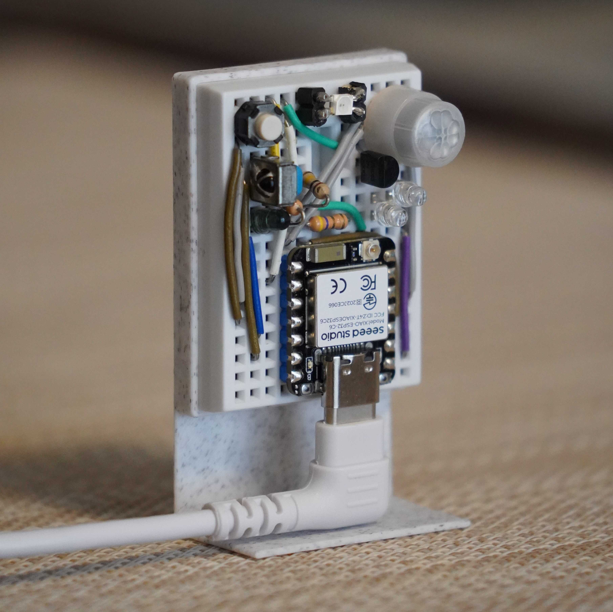
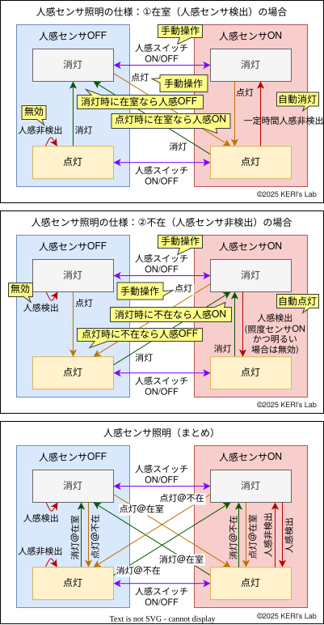
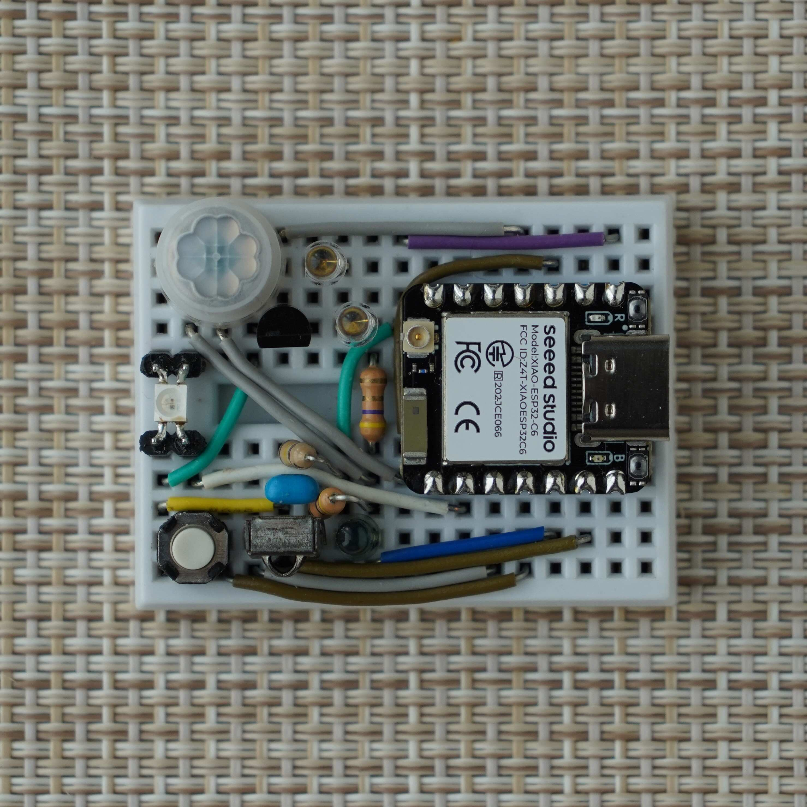
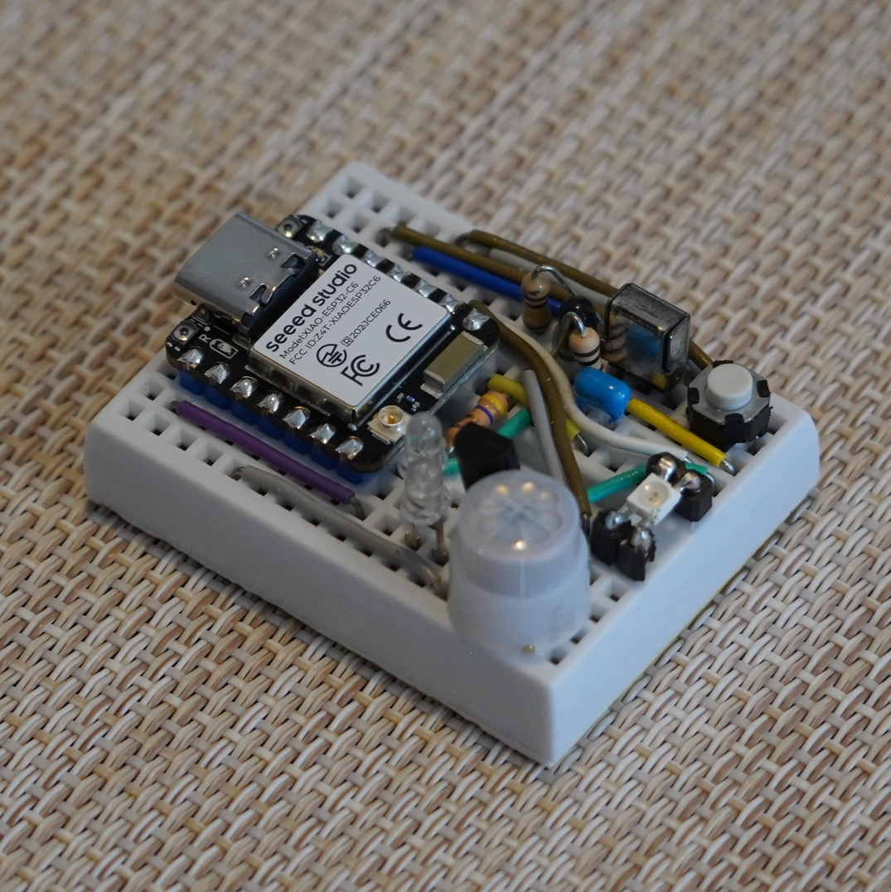
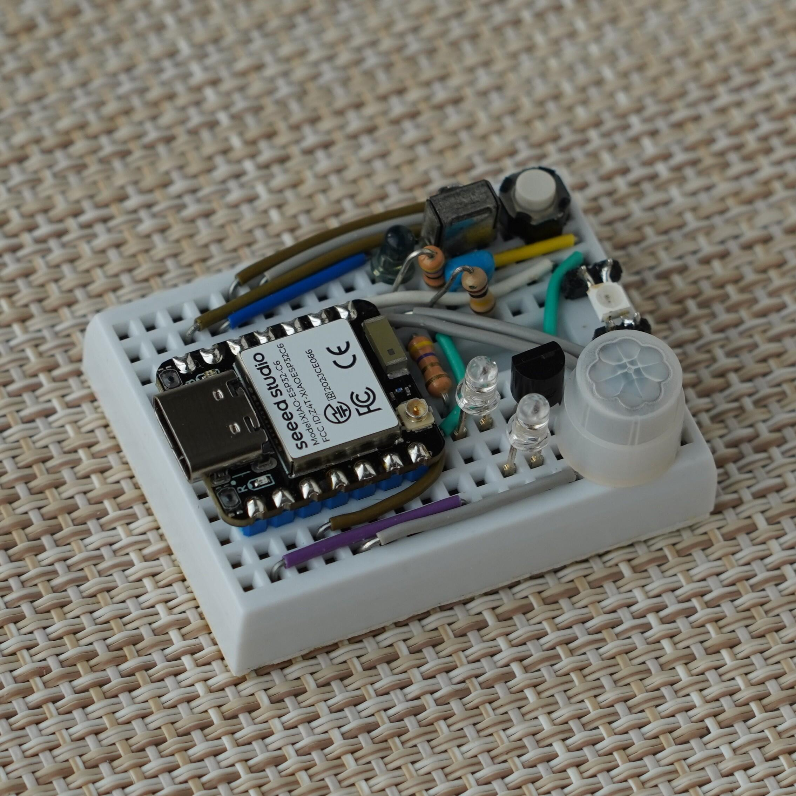
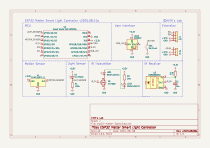

# ESP32 Matter Smart Light Controller - KERI's Lab

ESP32で作るMatterスマートホーム対応の人感センサ付き照明コントローラ。

## 機能

- 赤外線学習リモコン
  - 照明のリモコンの赤外線データを録画して再生することで、照明のON/OFFを制御。
- 人感センサ
  - 焦電型人感センサが人を検知すると自動的に照明をON、一定時間不検出だと照明をOFFに制御。
- 照度センサ
  - 日中の明るい環境では照度センサにより自動照明ONを無効化するオプションを用意。
- Matter Endpoint
  - スマートホームの規格Matterに対応。
  - WiFi経由でGoogleHomeアプリやAmazonAlexaアプリなどから照明ON/OFFと人感センサON/OFFを操作可能。
- RGB LED
  - LEDの色で動作状態をお知らせ。
- 物理ボタン
  - 基板上のボタンを押して直接照明をON/OFF。
- リモコン連携
  - リモコンの信号を受光して照明のON/OFF状態を同期。
  - リモコンのボタンを複数回押して人感センサON/OFFを操作。
- WebUI
  - ブラウザから照明・センサの操作、赤外線学習、各種設定変更が可能。

---

## 使い方

### 初回セットアップ方法

1. Matterデバイス登録
   - Amazon Alexa/Google HomeアプリからMatterデバイスの追加を行う。
     - QRコード: https://project-chip.github.io/connectedhomeip/qrcode.html?data=MT:Y.K9042C00KA0648G00
     - ペアリングコード: 34970112332
   - Alexaアプリはなぜか2つ以上のデバイスがうまく追加できなかったので、GoogleHomeアプリ推奨。GoogleHomeでデバイスを追加してからAlexaにデバイスを共有すればAlexaにも設定できる。
   - Matterの製品登録していないので、認証されていないデバイスと警告が出るが続行する。
   - Matterには下記3〜4つのデバイスが追加されるので、適当に名前変更と部屋登録を行う。
     1. `照明デバイス`: 照明のON/OFFスイッチ。「リビングのライト」などの名前にしておくとよい。
     2. `プラグデバイス`: 人感センサのON/OFFスイッチ。プラグの種類は一般のプラグに設定しておく。また、人感センサという名前にすると「アレクサ、人感センサをオンにして」と操作できる。
     3. `照明デバイス（常夜灯）`: 常夜灯エンドポイントが有効な場合（デフォルト有効）に追加される。
     4. `端末デバイス`: 自動的に追加されるが特に使用しない。
2. 赤外線データ登録  
   照明ON/OFFの赤外線リモコンデータの登録を行う。WebUI（推奨）またはシリアルコンソールで操作する。
   - **WebUI**: 「設定」を開き「点灯ボタンを記録」「消灯ボタンを記録」を押してから10秒以内にリモコンを送信する。
   - **シリアルコンソール**: コマンド `record on` / `record off` を送信してから、照明リモコンのボタンを押す。
3. 各種設定（任意）  
   デフォルト値（タイムアウト300秒、照度センサON）で使用する場合は設定不要。WebUI（推奨）またはシリアルコンソールで変更できる。
   - **WebUI**: 「設定」セクションから各項目を変更して「設定を保存」を押す。
   - **シリアルコンソール**: `ambient <on|off>` で照度センサ連動、`timeout <秒数>` でタイムアウトを変更。現在値は `help` で確認。

### WebUI

WiFi接続後、デバイスのIPアドレスにブラウザでアクセスするとWebUIが表示される。  
IPアドレスはシリアルコンソールのログ、またはルーターのDHCPクライアント一覧から確認できる。

| 機能                             | 説明                                                                                                         |
| -------------------------------- | ------------------------------------------------------------------------------------------------------------ |
| 照明 / 人感センサ / 常夜灯の操作 | トグルボタンで直接ON/OFFを切り替える                                                                         |
| 明るさ連動の切り替え             | 照度センサ連動のON/OFFと閾値を設定する                                                                       |
| 赤外線リモコン学習               | 「設定」→「赤外線リモコン学習」からボタンごとに記録する（10秒以内にリモコン送信）                            |
| デバイス情報                     | 設定ペインを開くとIPアドレス（IPv4/IPv6）、Wi-Fi、ファームウェア版、稼働時間、登録済みFabric一覧を取得・表示 |
| デバイス名                       | ページタイトルとブラウザタブに表示される名前を設定する                                                       |
| ホスト名                         | `<ホスト名>.local` でのmDNSアクセスとOTA更新先に使用するホスト名を設定する                                   |
| 自動消灯タイムアウト             | 人感センサ不検出後に自動消灯するまでの秒数を設定する                                                         |
| 常夜灯エンドポイント             | Matterへの常夜灯デバイスの追加/削除を切り替える（要再起動）                                                  |

### 動作仕様

- 人感センサによる自動制御
  - 人感センサが有効な場合、人を検出すると照明がONになり、一定時間（デフォルトは5分）非検出だと照明がOFFになる。
- Matter経由での制御
  - Matterには「照明デバイス」と「プラグデバイス」が追加され、それぞれ照明ON/OFFと人感センサON/OFFを操作できる。
- 照明ON/OFFと人感センサON/OFFの連動
  - 在室（人感センサ検出）中にMatterから照明をOFFにすると、人感センサは自動的にOFFになる（即時に照明がONになるのを防ぐため）。
  - 在室（人感センサ検出）中にMatterから照明をONにすると、人感センサは自動的にONになる（人感センサがOFFだとそのまま外出した際につきっぱなしになるため）。
  - 不在（人感センサ非検出）中にMatterから照明をONにすると、人感センサは自動的にOFFになる（即時に照明がOFFになるのを防ぐため）。
  - 不在（人感センサ非検出）中にMatterから照明をOFFにすると、人感センサは自動的にONになる（人感センサのOFFになると入出したときにONにならないため）。
- 照度センサ
  - 照度センサがONの場合、明るいときは人感センサによる照明ONが一時的に無効となる。なお、不在による自動照明OFFは常に有効。また、Matterデバイスによる照明ONは可能。
- 物理ボタン
  - ボタンを押すたびに照明のON/OFFをトグルする。
  - ボタンを5秒長押しするとMatterを初期化 (Commissioning Modeに) する。
- 赤外線リモコン連携
  - 照明OFF状態でリモコンのONボタンを押すと、照明がON状態になる（人感センサは上記の連動動作）。
  - 照明ON状態でリモコンのOFFボタンを押すと、照明がOFF状態になる（人感センサは上記の連動動作）。
  - 照明ON状態でリモコンのONボタンを押すと、人感センサがトグルする。
  - 照明OFF状態でリモコンのOFFボタンを押すと、人感センサがトグルする。

### LEDランプの役割

|    LED    | 人感センサ連動 | 意味                                         |
| :-------: | :------------: | :------------------------------------------- |
|    白     |       ON       | 通常の人感センサ連動状態（人感非検出）       |
|    青     |       ON       | 通常の人感センサ連動状態（人感検出中）       |
|    消     |      OFF       | 人感センサ無効状態（人感スイッチがOFF）      |
|    黄     |       ON       | 照度センサで自動点灯が一時抑制（人感非検出） |
|   青緑    |       ON       | 照度センサで自動点灯が一時抑制（人感検出中） |
|    桃     |       -        | Matter 接続待機 (Commissioning) 状態         |
|    赤     |       -        | ネットワークエラー                           |
|    緑     |       -        | 赤外線信号の待機中                           |
| 緑 (点滅) |       -        | 赤外線信号の送受信                           |

---

## 作り方

### 対応マイコン

- ESP32-C6: Seeed Studio XIAO ESP32C6
- ESP32-S3: Seeed Studio XIAO ESP32S3

### 実機

とりあえずミニブレッドボードで製作。

### 回路

- ピンアサインはソースコード [app_config.h](firmware/main/app_config.h) を参照。
- 赤外線受光モジュール: OSRB38C9AA
  - 38kHzの一般的なもの。GPIOに接続するだけ。
- 赤外線LED: OSI5FU3A11C
  - 2つ直列、FET(2N7000など)で制御する。
  - 参考: [IR-Station/how-to-make.md | GitHub](https://github.com/kerikun11/IR-Station/blob/master/how-to-make.md)
- 人感センサ: EKMC1607111/EKMC1601111
  - GPIOに接続するだけ。
- 照度センサ: NJL7502L
  - 100kΩ程度でGNDにつなぐ(感度調整のため可変抵抗でもよい)。
  - 照度センサを使用しない場合はつながなくてよい。
- マイコン内蔵RGB LED: SK6812
  - DevKit上に実装されているものを使用。

### ファームウェア開発

開発環境、ビルド、USB書き込み、OTA更新、WebUIのプレビュー・テストは
[ファームウェア開発ガイド](firmware/README.md)を参照してください。

---

## ライセンス

- LGPL v2.1
