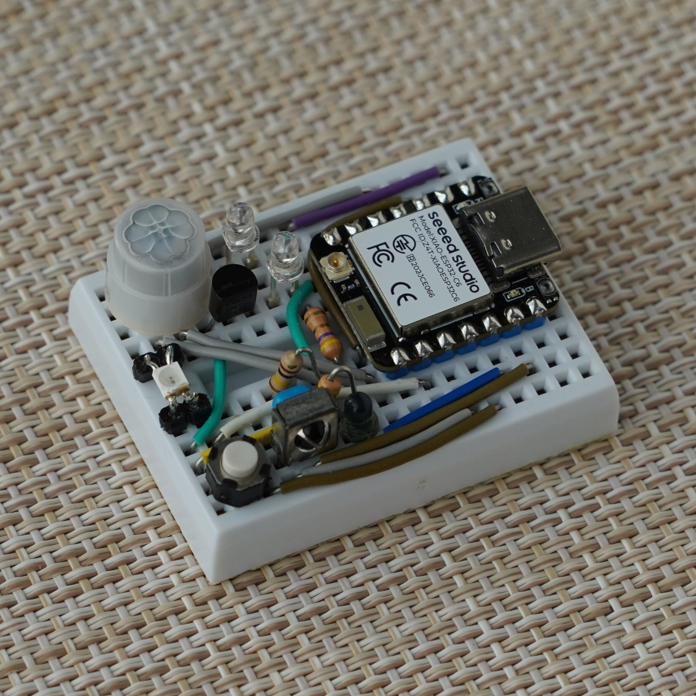

# ESP32 Matter Smart Light Controller

Matterスマートホーム対応、人感センサ付き照明コントローラ（赤外線学習リモコン）。



- 対応マイコン一覧
  - ESP32-C6
    - Seeed Studio XIAO ESP32C6
  - ESP32-S3
    - Seeed Studio XIAO ESP32S3
- 開発環境
  - [ESP-IDF](https://github.com/espressif/esp-idf) v5.4.2
  - [ESP-Matter](https://github.com/espressif/esp-matter) v1.4
  - [ESP32-Arduino](https://github.com/espressif/arduino-esp32) v3.2.1

## 機能

- 赤外線学習リモコン
  - 任意の照明リモコンON/OFFボタンの赤外線データを録画して再生。
  - 赤外線データは内蔵フラッシュメモリ (ESP32 Preferences) に保存。
- 人感センサ
  - 焦電型人感センサで人を検出して、照明の自動ON/OFFを制御。
- 照度センサ
  - 日中の明るい環境では照度センサにより自動照明ONを無効化するオプションを用意。
- RGB LED
  - LEDの色で動作状態をお知らせ。
- Matter Endpoint
  - スマートホームの規格Matterに対応。
  - WiFi経由でGoogleHomeアプリやAmazon Alexaアプリから操作可能。
- 物理ボタン
  - 基板上のボタンを押して直接照明をON/OFF。
- 赤外線リモコン連携
  - リモコンの信号を受光してON/OFF状態を同期。

---

## 使い方

### 初回セットアップ方法

1. Matterデバイス登録
   - Amazon Alexa/Google HomeアプリからMatterデバイスの追加を行う。
     - QRコード: https://project-chip.github.io/connectedhomeip/qrcode.html?data=MT:Y.K9042C00KA0648G00
     - ペアリングコード: 34970112332
   - Alexaアプリはなぜか2つ以上のデバイスがうまく追加できなかったので、GoogleHomeアプリ推奨。GoogleHomeでデバイスを追加してからAlexaにデバイスを共有すればAlexaにも設定できる。
   - Matterには下記3つのデバイスが追加されるので、部屋の登録と名前変更を行う。
     1. `照明デバイス`: 照明のON/OFFスイッチ。「リビングのライト」などの名前にしておくとよい。
     2. `プラグデバイス`: 人感センサのON/OFFスイッチ。プラグの種類は一般のプラグに設定しておく。また、人感センサという名前にすると「アレクサ、人感センサをオンにして」と操作できる。
     3. `端末デバイス`: 自動的に追加されるが特に使用しない。
2. 赤外線データ登録  
   照明ON/OFFの赤外線リモコンデータの登録を行う。
   1. シリアルコンソールでコマンド `record on` を送信してから、照明リモコンの `ONボタン` を押す。
   2. シリアルコンソールでコマンド `record off` を送信してから、照明リモコンの `OFFボタン`を押す。
3. 照度センサの設定 (デフォルトは照度センサON)  
   - 照度センサを使用する場合はシリアルコンソールでコマンド `ambient on` を送信する。
   - 照度センサを使用しない場合はシリアルコンソールでコマンド `ambient off` を送信する。
4. 自動照明OFFのタイムアウト設定 (デフォルトは300秒(=5分))  
   人が検出されなかったときに自動で照明をOFFにするタイムアウトを設定。
   - シリアルコンソールでコマンド `timeout <秒数>` を送信する。
   - 現在の値はコマンド `help` で確認できる。
   - あまり短くしすぎると、動いていないだけで照明が消えてしまう。

### 動作仕様

下図参照。

- 人感センサによる自動制御
  - 人感センサが有効な場合、人を検出すると照明がONになり、一定時間（デフォルトは5分）非検出だと照明がOFFになる。
- Matter経由での制御
  - Matterには「照明デバイス」と「プラグデバイス」が追加され、それぞれ照明ON/OFFと人感センサON/OFFを操作できる。
- 照明ON/OFFと人感センサON/OFFの連動
  - 在室（人感センサ検出）中にMatterから照明をOFFにすると、人感センサは自動的にOFFになる（即時に照明がONになるのを防ぐため）。
  - 在室（人感センサ検出）中にMatterから照明をONにすると、人感センサは自動的にONになる（人感センサがOFFだとそのまま外出した際につきっぱなしになるため）。
  - 不在（人感センサ非検出）中にMatterから照明をONにすると、人感センサは自動的にOFFになる（即時に照明がOFFになるのを防ぐため）。
  - 不在（人感センサ非検出）中にMatterから照明をOFFにすると、人感センサは自動的にONになる（人感センサのOFFになると入出したときにONにならないため）。
- 照度センサ
  - 照度センサがONの場合、明るいときは人感センサによる照明ONが一時的に無効となる。なお、不在による自動照明OFFは常に有効。また、Matterデバイスによる照明ONは可能。
- 物理ボタン
  - ボタンを押すたびに照明のON/OFFをトグルする。
  - ボタンを10秒長押しするとMatterを初期化 (Commissioning Modeに) する。
- 赤外線リモコン連携
  - 照明OFF状態でリモコンのONボタンを押すと、照明がON状態になる（人感センサは上記の連動動作）。
  - 照明ON状態でリモコンのOFFボタンを押すと、照明がOFF状態になる（人感センサは上記の連動動作）。
  - 照明ON状態でリモコンのONボタンを押すと、人感センサがトグルする。
  - 照明OFF状態でリモコンのOFFボタンを押すと、人感センサがトグルする。


### LEDランプの役割

|    LED    | 人感センサ連動 | 意味                                         |
| :-------: | :------------: | :------------------------------------------- |
|    白     |       ON       | 通常の人感センサ連動状態（人感非検出）       |
|    青     |       ON       | 通常の人感センサ連動状態（人感検出中）       |
|    消     |      OFF       | 人感センサ無効状態（人感スイッチがOFF）      |
|    黄     |      OFF       | 明るいため人感センサ無効の状態（人感非検出） |
|   青緑    |      OFF       | 明るいため人感センサ無効の状態（人感検出中） |
|    桃     |       -        | Matter Device Commissioning 状態             |
|    赤     |       -        | ネットワークエラー                           |
| 緑 (点滅) |       -        | 赤外線の送受信                               |

---

## 作り方

### 実機

とりあえずミニブレッドボードで製作。


### 回路


- ピンアサインはソースコード [app_config.h](firmware/main/app_config.h) を参照。
- 赤外線受光モジュール: OSRB38C9AA
  - 38kHzの一般的なもの。GPIOに接続するだけ。
- 赤外線LED: OSI5FU3A11C
  - 2つ直列、FET(2N7000など)で制御する。
  - 参考: [IR-Station/how-to-make.md | GitHub](https://github.com/kerikun11/IR-Station/blob/master/how-to-make.md)
- 人感センサ: EKMC1607111/EKMC1601111
  - GPIOに接続するだけ。
- 照度センサ: NJL7502L
  - 100kΩ程度でGNDにつなぐ(感度調整のため可変抵抗でもよい)。
  - 照度センサを使用しない場合はつながなくてよい。
- マイコン内蔵RGB LED: SK6812
  - DevKit上に実装されているものを使用。

### ビルド&書き込み方法

- [ESP-IDFのドキュメント](https://docs.espressif.com/projects/esp-idf/en/latest/esp32/versions.html)に従って開発環境を構築する (Linux推奨)。
  - 環境構築のしやすさ、ビルド時間などからLinux推奨
  - 現時点ではPlatformIOには非対応(ESP32-Arduino Matterライブラリが[非対応](https://github.com/platformio/platform-espressif32/issues/854)なため)
- ESP32のUSBポート(非UARTポート)とPCを接続して下記コマンドを実行する。

```sh
# at ESP-IDF v5.4.2 Environment
source $IDF_PATH/export.sh

# go to firmware directory
cd firmware

# select target
idf set-target esp32c6 # ESP32-C6 の場合
idf set-target esp32s3 # ESP32-S3 の場合

# build
idf build

# flash and monitor
idf flash monitor
```

### 参考

- [espressif/arduino-esp32 - Example esp_matter_light | ESP Component Registry](https://components.espressif.com/components/espressif/arduino-esp32/versions/3.0.5/examples/esp_matter_light?language=en)

---

## ライセンス

- LGPL v2.1 (Arduinoライブラリと同じライセンス)
